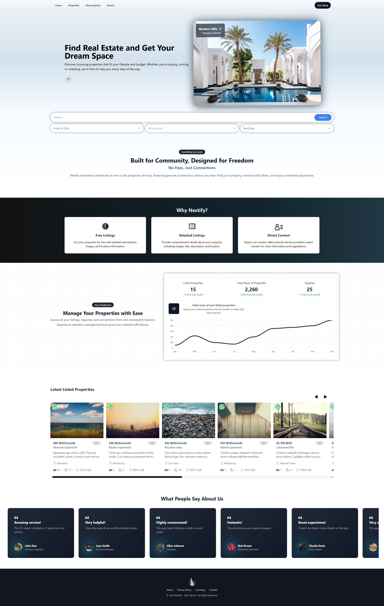

#🏠 [Nestify](https://nestify.up.railway.app/): Property Rental & Sales Platform
Welcome to **Nestify**, the ultimate property rental and sales platform, enabling **peer-to-peer** (C2C) connections between property owners and renters or buyers without any fees. Nestify provides a seamless way for users to post properties, view listings, and contact property owners.

## 🌟 Key Features

- **List Properties for Rent/Sale:** Property owners can easily post their properties, including relevant details such as price, location, and property type.
- **Search and Filter:** Users can search and filter properties based on location, price, property type, and other features.
- **User Profiles:** Property owners and renters/buyers can create and manage their profiles, view their activity, and manage their listings.
- **Direct Contact:** Direct communication between property owners and interested parties for quick and easy negotiations.
- **Map-Based Listings:** Integrated maps for viewing properties by location, making it easy to browse nearby properties.
- **Mobile-Friendly Design:** Fully responsive design to ensure a smooth experience on mobile devices.

## 🔧 Technologies

- **Node.js:** JavaScript runtime for building the backend.
- **Express:** Backend framework for handling HTTP requests.
- **MongoDB:** NoSQL database for storing property and user data.
- **Mongoose:** Object Data Modeling (ODM) library for MongoDB.
- **Typesense:** Used for fast and powerful search functionality.
- **MapTiler:** For map-based property listings.

## 🖼️ Preview

